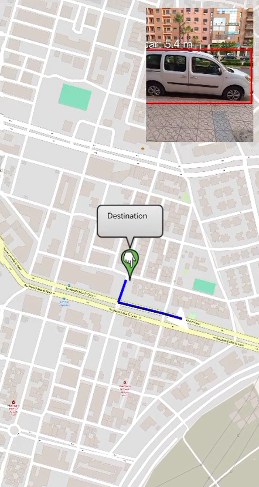

# GuideMalvoyant · Android Navigation Assistant for the Visually-Impaired

**GuideMalvoyant** is an Android (Kotlin) application that helps blind and visually-impaired people move around more safely and independently.  
It combines **real-time object detection**, **offline maps with GPS tracking**, **turn-by-turn voice guidance**, and **haptic feedback** in a single, privacy-friendly mobile assistant.

[](#) 
[](#license) 
[](#requirements)

---

## ✨ Key Features

| Capability | What it does |
|------------|--------------|
| **Real-time obstacle detection** | Runs a TensorFlow Lite vision model directly on-device (CPU / GPU) and speaks out nearby objects. |
| **Turn-by-turn voice navigation** | Uses GPS + OpenStreetMap (OSMDroid) tiles to compute a route, then announces directions through Text-to-Speech. |
| **Haptic safety cues** | Vibrates when an obstacle is dangerously close. |
| **Offline-first** | All ML inference and maps run without an internet connection once tiles and the `.tflite` model are on the device. |
| **High-contrast UI** | Extra-large buttons and bold colours make the screen usable for low-vision users. |
| **Open & customisable** | Swap in your own TensorFlow Lite model or map provider with minimal code changes. |

---

## 📱 Demo

<!--  -->

---

## 🏗️ Tech Stack

| Layer | Library / Framework | Why |
|-------|---------------------|-----|
| **Android UI** | Material 3, ConstraintLayout, ViewBinding | Modern native look and feel |
| **Camera** | CameraX 1.3.1 | Easy, lifecycle-aware access to the camera stream |
| **ML Inference** | TensorFlow Lite Task Vision 0.4.4, GPU delegate | Fast on-device object detection |
| **Navigation & Maps** | OSMDroid 6.1.17 | Offline OpenStreetMap tiles with no API-key hassle |
| **Speech** | Android TextToSpeech | Announces objects & directions |
| **Build** | Gradle 8, Kotlin 1.9.22, Compose-style DSL | Modern, stable build setup |

<details>
<summary>Dependencies excerpt (from <code>app/build.gradle</code>)</summary>

```gradle
implementation 'org.tensorflow:tensorflow-lite-task-vision:0.4.4'
implementation 'org.tensorflow:tensorflow-lite-gpu:2.14.0'
implementation 'org.osmdroid:osmdroid-android:6.1.17'
def camerax_version = "1.3.1"
implementation "androidx.camera:camera-view:$camerax_version"
...
compileSdk 34
minSdk 24
targetSdk 34
``` :contentReference[oaicite:0]{index=0}
</details>

---

## 📂 Project Structure (high-level)

